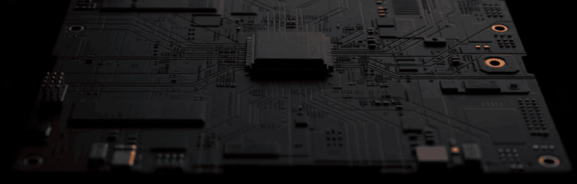
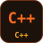
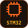
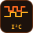
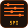
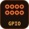
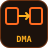
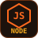

<a href="https://github.com/takemygunq">
  <picture>
    <source media="(prefers-color-scheme: dark)" srcset="assets/hero-dark.svg" />
    <source media="(prefers-color-scheme: light)" srcset="assets/hero-light.svg" />
    
  </picture>
</a>

<p align="center">
  
  
  
  
</p>

<p align="center">
  
</p>

### 🔌 About me

I'm an embedded developer — I'm happiest when code is driving real hardware. I write **C** firmware for **STM32**,
use **Raspberry Pi** as the brain of a device, and wire everything together with sensors over **UART, I²C, SPI and GPIO**.
**Python** is my go-to for scripts, debugging tools and anything running on the Pi. When a device needs a UI
or a server, I add a bit of **frontend and backend**.

```c
typedef struct {
    const char *focus;      // "Embedded"
    const char *mcu[2];     // { "STM32", "Raspberry Pi" }
    const char *bus[4];     // { "UART", "I2C", "SPI", "GPIO" }
    const char *lang[2];    // { "C", "Python" }
    const char *side_quest; // "frontend + backend"
} developer_t;

static const developer_t nevzorl = {
    .focus      = "Embedded",
    .mcu        = { "STM32", "Raspberry Pi" },
    .bus        = { "UART", "I2C", "SPI", "GPIO" },
    .lang       = { "C", "Python" },
    .side_quest = "frontend + backend",
};
```

### 🛠️ Tech stack

<table>
  <tr>
    <td width="130"><b>⚡ Embedded</b></td>
    <td>      </td>
  </tr>
  <tr>
    <td><b>📡 Hardware</b></td>
    <td>         <br/><sub>STM32 HAL / CMSIS / bare registers · Raspberry Pi · datasheets · logic analyzer &amp; oscilloscope</sub></td>
  </tr>
  <tr>
    <td><b>🌐 Web</b></td>
    <td>     </td>
  </tr>
  <tr>
    <td><b>☕ JVM</b></td>
    <td> </td>
  </tr>
  <tr>
    <td><b>🧰 Tools</b></td>
    <td>   </td>
  </tr>
</table>

### 📦 Projects

| | Project | What it is | Stack |
|---|---|---|---|
| 🔌 | [**CircuitMind**](https://github.com/takemygunq/CircuitMind) | An AI electronics designer: describe a device, get the wiring diagram, schematic, calculations, simulation and firmware | TypeScript · Next.js · custom SVG engine |
| ⚖️ | [**Verdict**](https://github.com/takemygunq/Verdict) | An AI courtroom for marketing materials: a jury of AI models argues over your ad and delivers a verdict | TypeScript · Next.js · PixiJS |
| 🎮 | [**MineGranter**](https://github.com/takemygunq/MineGranter) | Minecraft server plugin: staff roles, shifts and player reports with Telegram notifications | Java · Spigot / Paper |

### 📬 Contact

<p align="left">
  <a href="https://t.me/zenvixanet"></a>
</p>

### 📊 Activity

<p align="center">
  <picture>
    <source media="(prefers-color-scheme: dark)" srcset="https://raw.githubusercontent.com/takemygunq/takemygunq/output/snake-dark.svg" />
    
  </picture>
</p>
